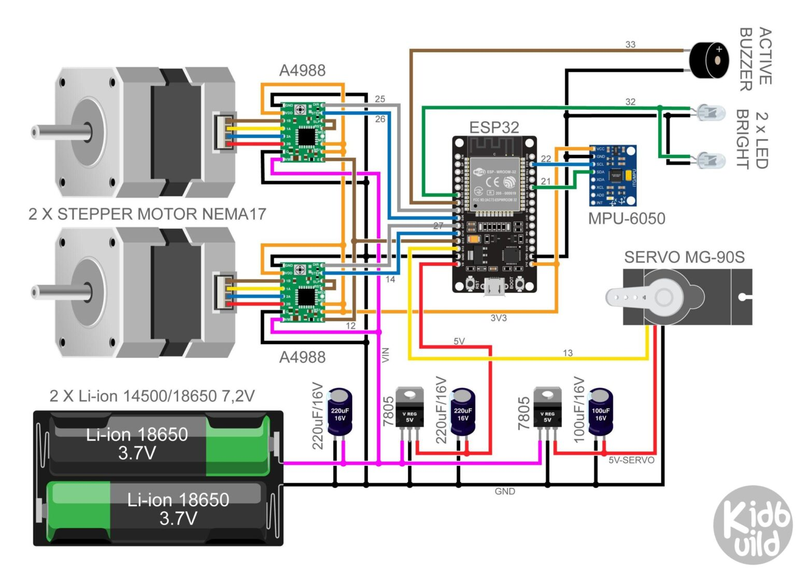
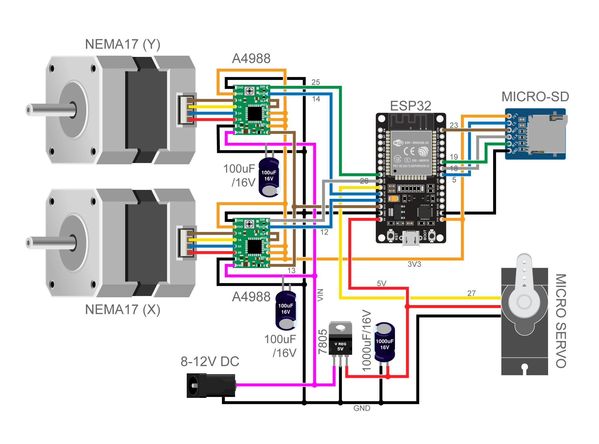

# Conversion Plan: Kidbuild Balancing Robot to Bluino Eggbot

For this conversion, the GPIO assignments for motor and servo control must be adjusted in the code, and the Micro SD card PCB must be wired correctly.

## Wiring Diagram Comparison
|Kidbuild Balancing Robot|Bluino Eggbot|
|-|-|
|||

## Motor and Servo GPIO Changes

|Signal|Kidbuild Balancing Robot|Bluino Eggbot|Change|
|-|-|-|-|
|Motor 1 Dir|GPIO 25|GPIO 25|none|
|Motor 1 Step|GPIO 26|GPIO 14|changed|
|Motor 2 Dir|GPIO 27|GPIO 26|changed|
|Motor 2 Step|GPIO 14|GPIO 12|changed|
|Servo|GPIO 13|GPIO 27|changed|

## Micro SD PCB (SPI) and Reusing Unused IMU Pins

Assumption: The previous IMU used I2C on `GPIO 21 (SDA)` and `GPIO 22 (SCL)`.

A typical SPI Micro SD board needs 4 signals: `SCK`, `MOSI`, `MISO`, `CS`.
You can reuse the former IMU pins for part of the SPI bus.

|SD signal|GPIO proposal|Source/comment|
|-|-|-|
|SCK|GPIO 22|formerly IMU `SCL`|
|MOSI|GPIO 21|formerly IMU `SDA`|
|MISO|GPIO 19|additional free GPIO (input)|
|CS (SS)|GPIO 33|free GPIO for chip select|
|VCC|3V3|do not use 5V logic level on ESP32|
|GND|GND|common ground|

### Code Changes in Grbl_ESP32

The following parameters must be checked or changed for the conversion (including Micro SD in one consolidated GPIO list):

```c
// Motors (from your table)
#define X_DIRECTION_PIN GPIO_NUM_25
#define X_STEP_PIN      GPIO_NUM_14
#define Y_DIRECTION_PIN GPIO_NUM_26
#define Y_STEP_PIN      GPIO_NUM_12

// Servo
#define Z_SERVO_PIN     GPIO_NUM_27

// Micro SD (SPI)
#define GRBL_SPI_SCK    GPIO_NUM_22
#define GRBL_SPI_MISO   GPIO_NUM_19
#define GRBL_SPI_MOSI   GPIO_NUM_21
#define GRBL_SPI_SS     GPIO_NUM_33

// Optional: SD card detect (only if available on your module)
#define SDCARD_DET_PIN  GPIO_NUM_<your_pin>
```

Files where these defines are typically set:

- `Grbl_Esp32/src/Machines/<your_machine>.h` (motor/servo/SPI pins)
- `Grbl_Esp32/src/Machine.h` (active machine file selection)
- `platformio.ini` via `-DMACHINE_FILENAME=...` (alternative machine selection)

### Important Notes

- `GPIO 34` to `GPIO 39` are input-only and therefore not suitable for `SCK`, `MOSI`, or `CS`.
- Use boot strapping pins (`GPIO 0`, `2`, `12`, `15`) with caution for `CS`.
- `GPIO 6` to `GPIO 11` are internally used by flash and must not be used.